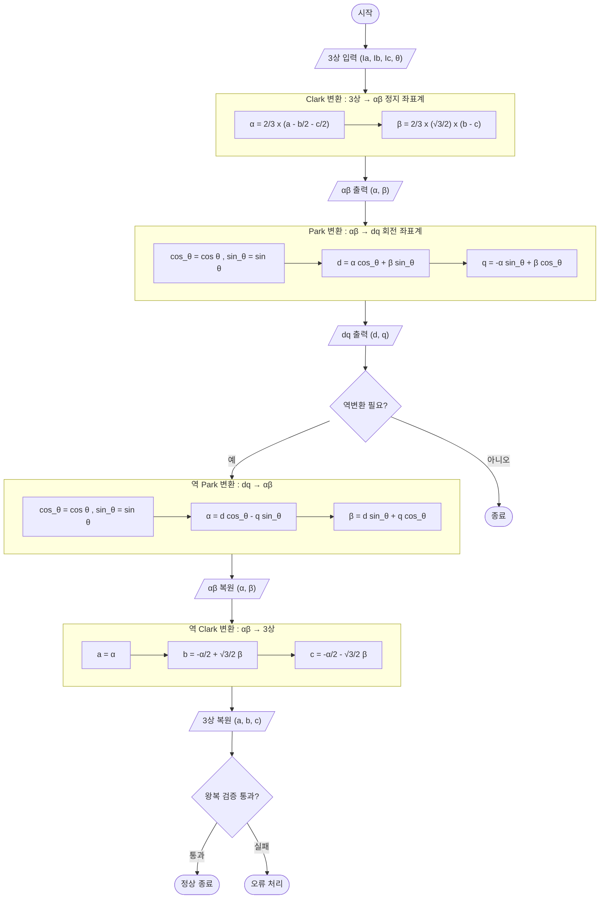

# Clark & Park 변환 Activity Diagram

```mermaid
flowchart TD
    Start([시작]) --> InputPhase[/"3상 입력 (Ia, Ib, Ic, θ)"/]

    InputPhase --> ClarkSection

    subgraph ClarkSection["Clark 변환 : 3상 → αβ 정지 좌표계"]
        CalcAlpha["α = 2/3 x (a - b/2 - c/2)"]
        CalcBeta["β = 2/3 x (√3/2) x (b - c)"]
        CalcAlpha --> CalcBeta
    end

    ClarkSection --> ClarkOut[/"αβ 출력 (α, β)"/]
    ClarkOut --> ParkSection

    subgraph ParkSection["Park 변환 : αβ → dq 회전 좌표계"]
        CalcTrig["cos_θ = cos θ , sin_θ = sin θ"]
        CalcD["d = α cos_θ + β sin_θ"]
        CalcQ["q = -α sin_θ + β cos_θ"]
        CalcTrig --> CalcD --> CalcQ
    end

    ParkSection --> DQOut[/"dq 출력 (d, q)"/]
    DQOut --> NeedInverse{역변환 필요?}

    NeedInverse -- 아니오 --> EndForward([종료])
    NeedInverse -- 예 --> InvParkSection

    subgraph InvParkSection["역 Park 변환 : dq → αβ"]
        InvTrig["cos_θ = cos θ , sin_θ = sin θ"]
        InvAlpha["α = d cos_θ - q sin_θ"]
        InvBeta["β = d sin_θ + q cos_θ"]
        InvTrig --> InvAlpha --> InvBeta
    end

    InvParkSection --> InvParkOut[/"αβ 복원 (α, β)"/]
    InvParkOut --> InvClarkSection

    subgraph InvClarkSection["역 Clark 변환 : αβ → 3상"]
        RestoreA["a = α"]
        RestoreB["b = -α/2 + √3/2 β"]
        RestoreC["c = -α/2 - √3/2 β"]
        RestoreA --> RestoreB --> RestoreC
    end

    InvClarkSection --> RestoredOut[/"3상 복원 (a, b, c)"/]
    RestoredOut --> Verify{왕복 검증 통과?}

    Verify -- 통과 --> EndSuccess([정상 종료])
    Verify -- 실패 --> EndError([오류 처리])
```
